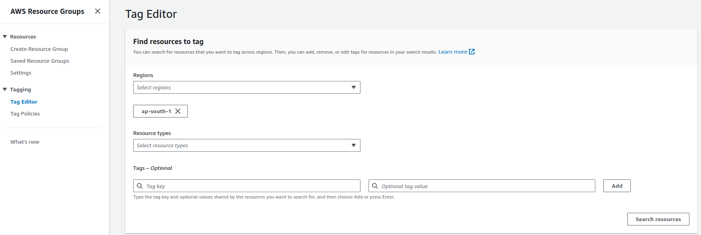
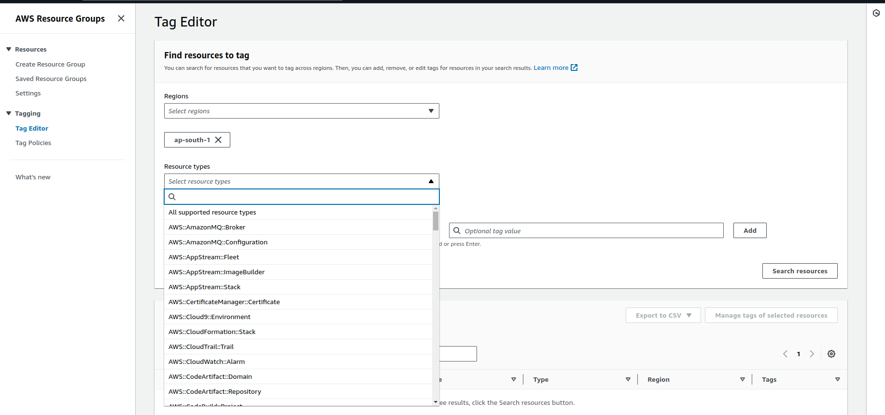
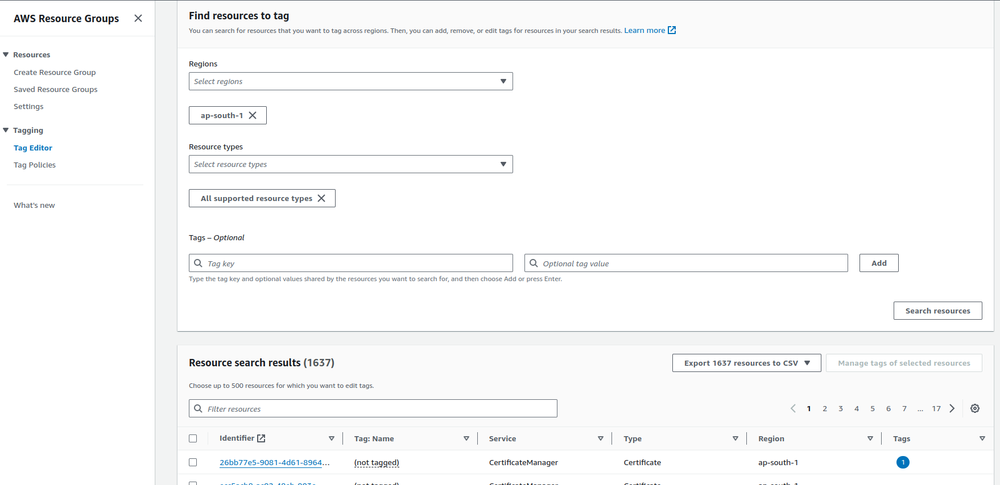
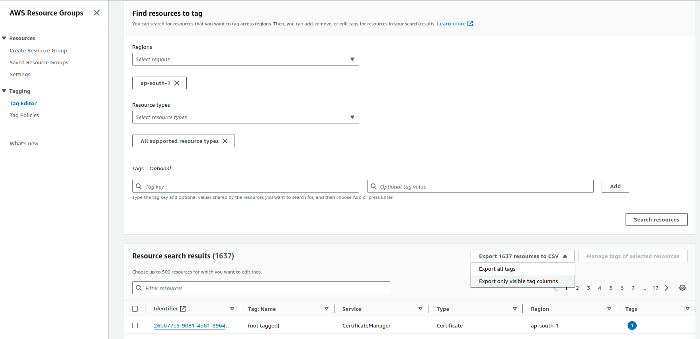

# AWS Resource Listing using Tag Editor

This guide will help you list resources in your AWS account using the Tag Editor. Follow the steps below to select the region, resource type, and search for resources.

## Prerequisites

- AWS Management Console access
- Appropriate permissions to use the Tag Editor and view resources

## Steps to List Resources

### Step 1: Open Tag Editor

1. Log in to the [AWS Management Console](https://aws.amazon.com/console/).
2. In the top navigation bar, click on **Services**.
3. Under **Management & Governance**, click on **Resource Groups** and then select **Tag Editor**.

### Step 2: Select the Region

1. In the Tag Editor, select the region where your resources are located from the **Region** drop-down menu.

### Step 3: Choose Resource Types

1. Click on the **Resource types** drop-down menu.
2. Select the resource types you want to list. You can choose multiple resource types.

### Step 4: Search for Resources

1. Click on the **Search resources** button to list all the resources based on your selected region and resource types.

### Step 5: View and Export Resource List

1. The results will be displayed in a table format.
2. To export the list of resources, click on the **Export resources to CSV** button and choose **Export only visible tag columns** .

## Troubleshooting

- Ensure you have the necessary permissions to access and view resources in the selected region.
- If no resources are listed, verify that you have selected the correct region and resource types.

## Conclusion

By following these steps, you can easily list and manage your AWS resources using the Tag Editor. For more information, refer to the [AWS Tag Editor Documentation](https://docs.aws.amazon.com/ARG/latest/userguide/tag-editor.html).

