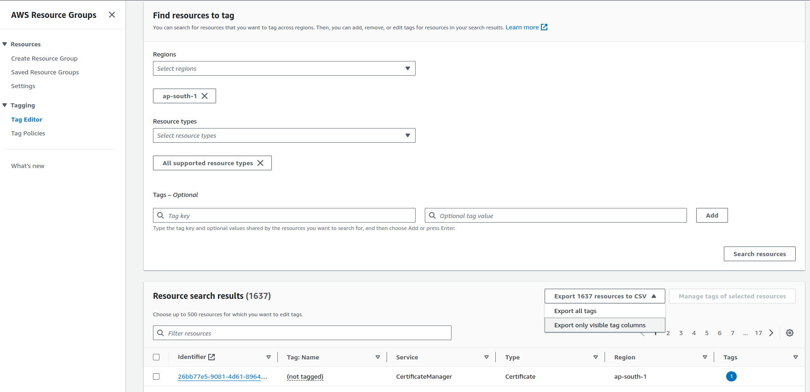

## The Process of Implementing CostOps is Divided into 4 steps namely Step A,B,C,D.

# Step A
In this step we are going to list down all the resources present in the AWS account using AWS Tag Editor

# AWS Resource Listing using Tag Editor

This guide will help you list resources in your AWS account using the Tag Editor. Follow the steps below to select the region, resource type, and search for resources.

## Prerequisites

- AWS Management Console access
- Appropriate permissions to use the Tag Editor and view resources

## Steps to List Resources

### Step 1: Open Tag Editor

1. Log in to the [AWS Management Console](https://aws.amazon.com/console/).
2. In the top navigation bar, click on **Services**.
3. Under **Management & Governance**, click on **Resource Groups** and then select **Tag Editor**.


### Step 2: Select the Region

1. In the Tag Editor, select the region where your resources are located from the **Region** drop-down menu.


### Step 3: Choose Resource Types

1. Click on the **Resource types** drop-down menu.
2. Select the resource types you want to list. You can choose multiple resource types.


### Step 4: Search for Resources

1. Click on the **Search resources** button to list all the resources based on your selected region and resource types.


### Step 5: View and Export Resource List

1. The results will be displayed in a table format.
2. To export the list of resources, click on the **Export resources to CSV** button and choose **Export only visible tag columns** .



## Troubleshooting

- Ensure you have the necessary permissions to access and view resources in the selected region.
- If no resources are listed, verify that you have selected the correct region and resource types.

## Conclusion

By following these steps, you can easily list and manage your AWS resources using the Tag Editor. For more information, refer to the [AWS Tag Editor Documentation](https://docs.aws.amazon.com/ARG/latest/userguide/tag-editor.html).


# Step B
In this step we are going to map each resource based on their Functionality to predefined Modules, SubModules & additionally adding Owner,Project Name,Name tags

# AWS Resource Mapping Guide

This guide provides the instructions and template for mapping all AWS resources into a CSV file. Follow the steps below to ensure all resources are correctly documented.

## Prerequisites

1. **AWS Management Console Access**: Ensure you have access to the AWS Management Console.
2. **AWS CLI**: Install and configure the AWS CLI with your credentials. You can follow the installation guide [here](https://docs.aws.amazon.com/cli/latest/userguide/install-cliv2.html).
3. **Permissions**: Ensure you have the necessary permissions to list and describe resources in your AWS account.

## CSV Template Format

The CSV file should include the following columns:

| Module                 | Sub-module | Resource Type | Resource Sub-Type | Resource Identifier | Resource Name | Tags | Owner | Environment | Module                 | Sub-module | Project     | Resource Full Name                      |
|------------------------|------------|---------------|-------------------|---------------------|---------------|------|-------|-------------|------------------------|------------|-------------|-----------------------------------------|
| Platform Common Modules| Test       | EC2           | TargetGroup       |                     | policy        |      | Lumiq | UAT         | Platform Common Modules| Test       | Dataverse   | empower-hdfcamc-uat-policy             |
|                        |            |               |                   |                     |               |      |       |             |                        |            |             |                                         |
| Platform Common Modules|            |               |                   |                     |               |      |       |             | Platform Common Modules| 0          | Dataverse   |                                         |
|                        |            |               |                   |                     |               |      |       |             |                        | 0          | Dataverse   |                                         |
|                        |            |               |                   |                     |               |      |       |             |                        | 0          | Dataverse   |                                         |

## Column Descriptions

- **Module**: The main module category (e.g., Platform Common Modules, Ingestion, Processing, Dataxchange, Development).
- **Sub-module**: The sub-module category within the main module.
- **Resource Type**: The type of AWS resource (e.g., EC2, S3, Glue).
- **Resource Sub-Type**: The sub-type of the resource if applicable (e.g., Instance, Bucket, Job).
- **Resource Identifier**: The unique identifier for the resource (e.g., instance ID, ARN).
- **Resource Name**: The name of the resource.
- **Tags**: Any tags associated with the resource.
- **Owner**: The owner of the resource.
- **Environment**: The environment where the resource is deployed (e.g., UAT, Production).
- **Project**: The project associated with the resource.
- **Resource Full Name**: A descriptive name for the resource combining relevant details.

## Instructions

1. **Review the Provided Template**: Familiarize yourself with the template structure and column descriptions provided above.
2. **Identify Resources**: Use the AWS Management Console or AWS CLI to list and describe resources in your account.
3. **Map Resources**: Fill in the CSV file using the template format, ensuring all resources are mapped correctly.
    - Use the **Module** and **Sub-module** values to categorize resources.
    - Provide accurate values for **Resource Type**, **Resource Sub-Type**, and **Resource Identifier**.
    - Include the **Resource Name**, **Tags**, **Owner**, **Environment**, **Project**, and **Resource Full Name** for each resource.

### Example

Here is an example of how to fill in the CSV file:

```csv
Module,Sub-module,Resource Type,Resource Sub-Type,Resource Identifier,Resource Name,Tags,Owner,Environment,Module,Sub-module,Project,Resource Full Name
Platform Common Modules,Test,EC2,TargetGroup,,policy,,Lumiq,UAT,Platform Common Modules,Test,Dataverse,empower-hdfcamc-uat-policy
```

# Step C
Based on the sheet from above step, In this step we are going to Implement the tagging on resources.

# AWS Resource Tagging Script

This script tags AWS resources listed in a CSV file using the `boto3` library. It supports tagging for various AWS services such as EC2, S3, RDS, and more.

## Prerequisites

1. **Python 3.6+**: Ensure you have Python installed on your system. You can download it from [python.org](https://www.python.org/downloads/).

2. **AWS CLI**: Install and configure the AWS CLI with your credentials. You can follow the installation guide [here](https://docs.aws.amazon.com/cli/latest/userguide/install-cliv2.html).

3. **AWS IAM Role/Policy**: Ensure you have the necessary permissions to tag resources. The following policy grants the necessary permissions:
    ```json
    {
        "Version": "2012-10-17",
        "Statement": [
            {
                "Effect": "Allow",
                "Action": [
                    "resourcegroupstaggingapi:TagResources",
                    "s3:GetBucketLocation",
                    "s3:HeadBucket",
                    "s3:PutBucketTagging"
                ],
                "Resource": "*"
            }
        ]
    }
    ```

## Installation

1. **Clone the Repository**:
    ```bash
    git clone https://codebase.aps1aws.lumiq.int/abdul.raheem/CostOps-Templates.git
    cd CostOps-Templates/AWS/Tagging-Resources/
    ```

2. **Create a Virtual Environment (optional but recommended)**:
    ```bash
    python -m venv venv
    source venv/bin/activate   # On Windows, use `venv\Scripts\activate`
    ```

3. **Install the Required Packages**:
    ```bash
    pip install boto3 pandas
    ```

## Usage

1. **Prepare Your CSV File**:
    - Ensure your CSV file (`Sample.csv`) contains the following columns:
        - `Identifier`: The resource identifier (e.g., instance ID, bucket name).
        - `Service`: The AWS service (e.g., EC2, S3).
        - `Type`: The resource type (e.g., Instance, Bucket).
        - `Owner`, `Environment`, `Module`, `Sub-module`, `Project Name`, `Name`: Tags to apply.

2. **Run the Script**:
    - Place your CSV file in the same directory as the script.
    - Run the script:
        ```bash
        python tagging-resources.py
        ```

## Script Explanation

The script performs the following steps:

1. **Load the CSV File**: Reads the CSV file containing the resource details and tags.
    ```python
    csv_file_path = 'Sample.csv'
    df = pd.read_csv(csv_file_path)
    ```

2. **Initialize boto3 Clients**: Initializes `boto3` clients for resource tagging and S3 operations.
    ```python
    tagging_client = boto3.client('resourcegroupstaggingapi', region_name='ap-south-1')
    s3_client = boto3.client('s3', region_name='ap-south-1')
    ```

3. **Helper Functions**:
    - `get_bucket_region(bucket_name)`: Retrieves the region of an S3 bucket.
    - `bucket_exists(bucket_name)`: Checks if an S3 bucket exists in the correct region.
    - `tag_s3_bucket(bucket_name, tags)`: Tags an S3 bucket.
    - `generate_arn(service, resource_id, resource_type)`: Generates ARNs for various AWS resources.
    - `tag_resource(resource_arn, tags)`: Tags a resource using its ARN.

4. **Iterate and Tag Resources**: Iterates over the CSV rows and tags each resource.
    ```python
    for index, row in df.iterrows():
        resource_id = row['Identifier']
        service = row['Service']
        resource_type = row['Type']
        tags = {
            'Owner': row['Owner'],
            'Environment': row['Environment'],
            'Module': row['Module'],
            'Sub-module': row['Sub-module'],
            'Project Name': row['Project Name'],
            'Name': row['Name']
        }
        resource_arn = generate_arn(service, resource_id, resource_type)
        if service == 'S3' and resource_type == 'Bucket':
            tag_s3_bucket(resource_id, tags)
        elif resource_arn:
            tag_resource(resource_arn, tags)
        else:
            print(f"Unsupported resource type for {resource_id}")
    ```

## Conclusion

By following these steps, you can tag AWS resources efficiently using the provided script. Ensure your CSV file is formatted correctly and you have the necessary AWS permissions to perform tagging operations.

# Step D
Here we are going to generate cost in each client account group by Service,Module,submodule.

# Cost Report CSV Template Guide

This guide provides the format for the CSV file that should be used to report the monthly and weekly costs for each project. The CSV file should be structured with specific columns to ensure consistency and accuracy in the billing details.

## CSV Template Format

The CSV file should include the following columns for the cost report:

### Service level Template

| CustomerName | ProjectName | CloudProvider | StartDate | EndDate | ServiceName | CostUSD | Environment |
|--------------|-------------|---------------|-----------|---------|-------------|---------|-------------|
|              |             |               |           |         |             |         |             |
|              |             |               |           |         |             |         |             |
|              |             |               |           |         |             |         |             |

### Module Level Template

| CustomerName | ProjectName | CloudProvider | StartDate | EndDate | Module | CostUSD | Environment |
|--------------|-------------|---------------|-----------|---------|--------|---------|-------------|
|              |             |               |           |         |        |         |             |
|              |             |               |           |         |        |         |             |
|              |             |               |           |         |        |         |             |

### SubModule Level Template

| CustomerName | ProjectName | CloudProvider | StartDate | EndDate | Module | SubModule | CostUSD | Environment |
|--------------|-------------|---------------|-----------|---------|--------|-----------|---------|-------------|
|              |             |               |           |         |        |           |         |             |
|              |             |               |           |         |        |           |         |             |
|              |             |               |           |         |        |           |         |             |

## Column Descriptions

- **CustomerName**: The name of the customer for whom the cost report is being generated.
- **ProjectName**: The name of the project associated with the cost.
- **CloudProvider**: The cloud provider (e.g., AWS, Azure, GCP) where the services are hosted.
- **StartDate**: The start date of the billing period in `YYYY-MM-DD` format.
- **EndDate**: The end date of the billing period in `YYYY-MM-DD` format.
- **ServiceName**: The name of the service being billed (only in the Basic Template).
- **Module**: The module associated with the cost (used in the Module Level and SubModule Level Templates).
- **SubModule**: The submodule associated with the cost (only in the SubModule Level Template).
- **CostUSD**: The cost in USD for the specified service/module/submodule.
- **Environment**: The environment (e.g., Development, Staging, Production) where the service/module/submodule is deployed.

# AWS Cost by Service Report

This Python script generates a report of AWS costs by service for a specified time period and saves the results to a CSV file.

## Prerequisites

- Python 3.8 or higher
- boto3 library
- pandas library
- AWS credentials configured

## Installation

1. Install the required Python libraries using pip:
    ```sh
    pip install boto3 pandas
    ```

2. Ensure your AWS credentials are configured. You can configure them using the AWS CLI or by setting environment variables.

## Script Details

The script performs the following steps:

1. Configures the AWS Cost Explorer client.
2. Defines the time period and granularity for the cost report.
3. Retrieves cost and usage data from AWS Cost Explorer.
4. Converts the response to a Pandas DataFrame.
5. Saves the DataFrame to a CSV file.

## Usage

1. **Modify the Time Period**: Change the `Start` and `End` dates in the `time_period` dictionary to your desired time range.
    ```python
    time_period = {
        'Start': '2024-05-16',  # Replace with your start date
        'End': '2024-05-31'     # Replace with your end date
    }
    ```

2. **Customize Customer and Project Details**: Replace the `CustomerName`, `ProjectName`, and `Environment` values with actual values relevant to your project.
    ```python
    aws_data.append({
        'CustomerName': 'Lumiq',  # Replace with actual customer name
        'ProjectName': 'LumiqInternal',  # Replace with actual project name
        'CloudProvider': 'AWS',
        'StartDate': result['TimePeriod']['Start'],
        'EndDate': result['TimePeriod']['End'],
        'ServiceName': group['Keys'][0],
        'CostUSD': round(float(group['Metrics']['UnblendedCost']['Amount']), 2),
        'Environment': 'DEV'  # Replace with actual environment
    })
    ```

3. **Specify the Output Filename**: Change the `aws_csv_file` variable to the desired output CSV filename.
    ```python
    aws_csv_file = 'aws_internal_cost_report2.csv'  # Replace with your desired filename
    ```

4. **Run the Script**: Execute the script to generate the cost report.
    ```sh
    python3 cost_by_service.py
    ```

## Script

```python
import boto3
import pandas as pd

# Configure AWS client
client = boto3.client('ce', region_name='ap-south-1')

# Define the time period and granularity
time_period = {
    'Start': '2024-05-16',
    'End': '2024-05-31'
}

response = client.get_cost_and_usage(
    TimePeriod=time_period,
    Granularity='MONTHLY',
    Metrics=['UNBLENDED_COST'],
    GroupBy=[{'Type': 'DIMENSION', 'Key': 'SERVICE'}]
)

# Convert the response to a DataFrame
aws_data = []
for result in response['ResultsByTime']:
    for group in result['Groups']:
        aws_data.append({
            'CustomerName': 'Lumiq',  # Replace with actual customer name
            'ProjectName': 'LumiqInternal',  # Replace with actual project name
            'CloudProvider': 'AWS',
            'StartDate': result['TimePeriod']['Start'],
            'EndDate': result['TimePeriod']['End'],
            'ServiceName': group['Keys'][0],
            'CostUSD': round(float(group['Metrics']['UnblendedCost']['Amount']), 2),
            'Environment': 'DEV'  # Replace with actual environment
        })

aws_df = pd.DataFrame(aws_data)

# Save the AWS data to a CSV file
aws_csv_file = 'aws_internal_cost_report2.csv'
aws_df.to_csv(aws_csv_file, index=False)
print(f"AWS cost report saved to {aws_csv_file}")
```

## Instructions

1. **Choose the Appropriate Template**: Based on the level of detail required (basic, module, or submodule), select the appropriate template format from above.
2. **Fill in the Details**: Populate the columns with the relevant data for each project and billing period.
3. **Save the File**: Save the completed CSV file with an appropriate name that includes the billing period (e.g., `CostReport_May2024.csv`).
4. **Submit the Report**: Share the completed CSV file with the team lead or designated recipient for review.

## Example

Here is an example of a filled CSV file using the Basic Template:

```csv
CustomerName,ProjectName,CloudProvider,StartDate,EndDate,ServiceName,CostUSD,Environment
AcmeCorp,ProjectA,AWS,2024-05-01,2024-05-31,EC2,100.00,Production
AcmeCorp,ProjectA,AWS,2024-05-01,2024-05-31,S3,50.00,Production
BetaInc,ProjectB,GCP,2024-05-01,2024-05-31,ComputeEngine,200.00,Development
```
